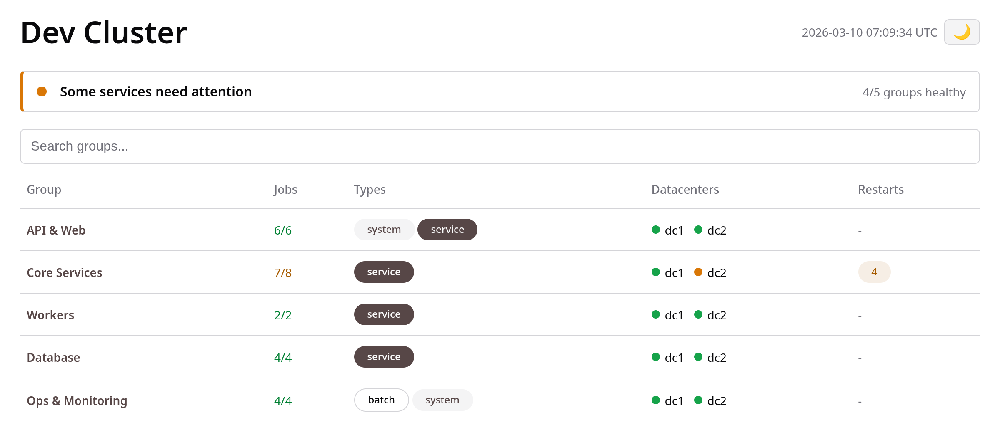

# nomadboard

[](https://zerodha.tech)

A read-only status page for Nomad clusters. Groups jobs into logical services, shows health at a glance, and highlights restarts.



## Features

- **Multi-DC consolidation** - Connect to multiple Nomad clusters and see everything in one page.
- **Job grouping** - Group related jobs via a HUML config file. Groups can span multiple namespaces.
- **Restart detection** - Shows restart counts within a display window, with a separate shorter alert window for health decisions (avoids false alerts from planned restarts).
- **Live updates** - Pages refresh automatically via Server-Sent Events (SSE). No manual reload needed.
- **Drill-down** - Dashboard > Group > Job > Allocations > Task events.
- **No IPs exposed** - Only shows node names, alloc IDs, and task names. Optional IP masking for node names.
- **Read-only** - Only uses Nomad read APIs. No write operations.
- **Glob patterns** - Match job names with `*` wildcards.
- **Single binary** - No JS build step, no node_modules. Just Go + embedded templates.

## Quick Start

```bash
# Copy and edit config
cp config.example.huml config.huml
# Edit clusters and groups...

# Run
go run main.go -config config.huml

# Or build and run
make build
./nomadboard -config config.huml

# Open http://localhost:9999
```

## Configuration

Configuration is in [HUML](https://huml.io/) format. See `config.example.huml` for a minimal setup.

```huml
clusters::
  - ::
    name: "dc1"
    address: "http://nomad.internal:4646"
    token_env: "NOMAD_TOKEN"

poll_interval: 30
restart_window: "24h"
restart_alert_window: "30m"
restart_warn: 1
restart_crit: 5
listen: ":9999"

groups::
  - ::
    name: "My Service"
    namespace: "default"
    jobs::
      - "api-server"
      - "worker-*"
  - ::
    name: "Monitoring"
    namespaces::
      - "infra"
      - "platform"
    jobs::
      - "vmagent"
```

### Config Reference

| Field | Description | Default |
|---|---|---|
| `name` | Display name shown in UI header and page titles | `Nomad Pulse` |
| `clusters` | List of Nomad cluster endpoints | required |
| `clusters[].name` | Short DC name (shown in UI) | required |
| `clusters[].address` | Nomad HTTP API address | required |
| `clusters[].token_env` | Env var name containing ACL token | optional |
| `poll_interval` | Seconds between Nomad API polls | `30` |
| `per_page` | Max jobs per page in group view | `20` |
| `restart_window` | Display window - restarts shown in UI | `24h` |
| `restart_alert_window` | Alert window - restarts affecting health status | `30m` |
| `restart_warn` | Restart count (in alert window) for warning | `1` |
| `restart_crit` | Restart count (in alert window) for critical | `5` |
| `mask_node_ip` | Mask IP-like suffixes in node names (e.g. `myapp-10-0-1-5` → `myapp-***`) | `false` |
| `timezone` | IANA timezone for displaying timestamps (e.g. `Asia/Kolkata`) | `UTC` |
| `max_sse_conns` | Maximum concurrent SSE connections | `128` |
| `listen` | HTTP listen address | `:9999` |
| `groups` | List of job groups | required |
| `groups[].name` | Group display name | required |
| `groups[].namespace` | Nomad namespace (single) | optional |
| `groups[].namespaces` | Nomad namespaces (multiple) | optional |
| `groups[].priority` | Display order (lower first); groups without priority appear after prioritised ones | none |
| `groups[].jobs` | List of job name patterns (glob) | required |

## Pages

- **Dashboard** (`/`) - Table of groups with health status per DC, job counts, and restart indicators.
- **Group** (`/group/{slug}`) - Table of jobs in the group with type, DC, status, restart count.
- **Job** (`/job/{ns}/{id}?dc=X`) - Allocations with task states, restart info, and expandable event log.
- **Health** (`/healthz`) - Health check endpoint.

## Nomad ACL Policy

Nomadboard only needs read access. Create a minimal read-only ACL policy:

```hcl
namespace "*" {
  policy = "read"
}

node {
  policy = "read"
}
```

Apply it and create a token:

```bash
# Write the policy
nomad acl policy apply nomadboard-ro -description "Read-only access for nomadboard" nomadboard-policy.hcl

# Create a token with this policy
nomad acl token create -name="nomadboard" -policy="nomadboard-ro" -type="client"
```

Set the resulting secret ID in the environment variable referenced by `token_env` in your config.

## Building

```bash
# Development build
make build

# Linux amd64 release tarball
make dist

# Run tests
make test
```

## Stack

- Go stdlib (`net/http`, `html/template`, `embed`)
- [hashicorp/nomad/api](https://github.com/hashicorp/nomad/tree/main/api) - Nomad API client
- [go-huml](https://github.com/huml-lang/go-huml) - HUML config parser
- [knadh/paginator](https://github.com/knadh/paginator) - SQL-style pagination
- [Oat](https://oat.ink/) - CSS/JS UI library (~8KB, CDN)
